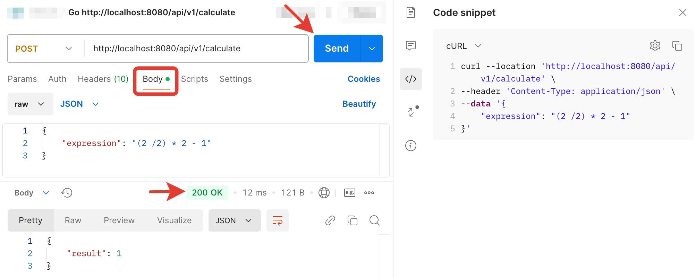

# Calculator Service

Веб-сервис для вычисления арифметических выражений. Поддерживает базовые арифметические операции (+, -, *, /) и скобки. Логика работы сервиса описана ниже в разделе API.

## Контакты для связи

- [Telegram](https://t.me/int99)
- [Email](mailto:erlangu@yandex.ru)

## Требования
### OS
Работа сервиса успешно протестирована в ОС: 
- Windows 11 | Go 1.22
- MacOS Ventura 13.3 | Go 1.21

### Go
Go 1.21 и выше

## Установка и запуск

1. Клонируйте репозиторий c GitHub
2. Откройте проект в IDE GoLand, Intellij IDEA или VS Code
3. Запустите сервис в терминале командой указанной ниже. Можно использовать терминал вашей среды разработки. Порт для запуска программы конфигурируется в переменной окружения PORT, вы можете указать любой свободный порт. Если не указать, то порт будет 8080. Для старта сервиса нужно выполнить только одну любую команду.
```
MacOS
вариант запуска с указанием порта: PORT=8081 go run cmd/calc_service/main.go
вариант запуска без указания порта: go run cmd/calc_service/main.go

Windows
вариант запуска с указанием порта: $env:PORT=8081; go run cmd/calc_service/main.go
вариант запуска без указания порта: go run cmd/calc_service/main.go
```
Если вы увидели сообщение "Starting server on :8080" - значит сервис успешно запустился.

4. Для проверки работы сервиса установите Postman https://www.postman.com/ 
5. Выполните запросы используя Postman.
Для этого откройте Postman -> нажмите на кнопку "Import" -> вставьте curl в строку "Past cURL" -> нажмите кнопку "Send" (все curl запросы указаны ниже)



6. В сервисе реализованы тесты, которые можно запустить командой (не обязательно):
```
go test ./tests/...
```
Если тесты пройдены успешно, вы увидите сообщение:
```
ok  calculator-service/tests  0.0XXs
```

## API
## Поддерживаемые операции

- Сложение (+)
- Вычитание (-)
- Умножение (*)
- Деление (/)
- Скобки ( )

### Примеры выражений

- `2 + 2`
- `(2 + 2) * 2`
- `10 / 2 - 3`
- `(5 + 3) * (2 - 1)`
- `(2 /2) * 2 - 1`

### Обработка запросов

Сервис возвращает следующие статус-коды:
- 200: Успешное вычисление
- 422: Некорректное выражение (неправильные символы, деление на ноль, лишние/отсутствующие скобки)
- 500: Внутренняя ошибка сервера (включая пустое тело запроса)

### Примеры запросов через curl:

1. Простое выражение (Response status code 200)
!!!если необходимо замените в curl запросе порт 8080 на другой, который вы указали при старте сервиса:
```
curl --location 'localhost:8080/api/v1/calculate' \
--header 'Content-Type: application/json' \
--data '{
  "expression": "2+2*2"
}'
```

2. Выражение со скобками (Response status code 200):
```
curl --location 'http://localhost:8080/api/v1/calculate' \
--header 'Content-Type: application/json' \
--data '{
    "expression": "(2 / 2) * 2 - 1"
}'
```

3. Выражение с некорректными символами (Response status code 422 "Expression is not valid"):
```
curl --location 'http://localhost:8080/api/v1/calculate' \
--header 'Content-Type: application/json' \
--data '{
    "expression": "2 - f"
}'
```

4. Пустое выражение (Response status code 422 "Expression is not valid"):
```
curl --location 'http://localhost:8080/api/v1/calculate' \
--header 'Content-Type: application/json' \
--data '{
    "expression": ""
}'
```

5. Пустое выражение, в теле запроса нет данных (status code 500 "Internal server error"):
```
curl --location 'http://localhost:8080/api/v1/calculate' \
--header 'Content-Type: application/json' \
--data ''
```